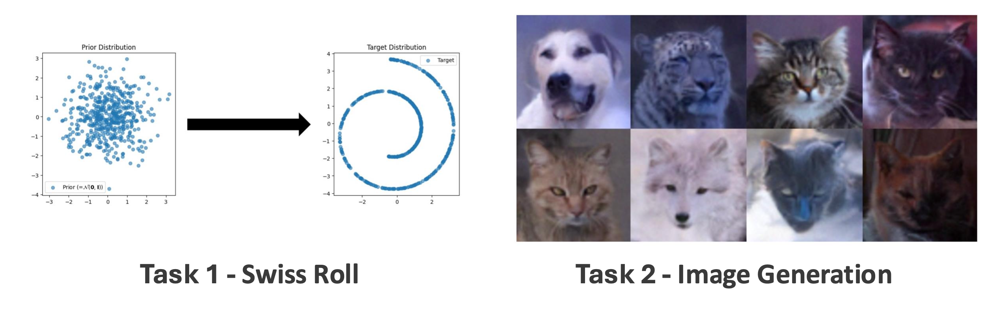

<div align=center>
  <h1>
  Denoising Diffusion Probabilistic Models (DDPM)  
  </h1>
  <p>
    <b>NYCU: Image and Video Generation (2025 Fall)</b><br>
    Programming Assignment 1
  </p>
</div> 

<div align=center>
  <p>
    Instructor: <b>Yu-Lun Liu</b><br>
    TA: <b>Yi-Chuan Huang</b>
  </p>
</div>

---

## 📘 Abstract


In this programming assignment, you will implement the **Denoising Diffusion Probabilistic Model (DDPM)**, a fundamental generative model that powers modern diffusion-based methods such as Stable Diffusion.  
We begin with a simple 2D toy dataset (Swiss Roll) to understand the forward and reverse diffusion processes.  
Then, we extend the pipeline to real images (AFHQ dataset), training a DDPM to generate animal images and evaluate performance using the FID metric.

- [Assignment Instructions (PDF)](./assets/Lab1-DDPM.pdf)
- [Denoising Diffusion Probabilistic Models (DDPM) – arXiv](https://arxiv.org/pdf/2006.11239)

---

## ⚙️ Setup

### Environment
Create a `conda` environment and install dependencies:
```bash
conda create -n ddpm python=3.9 -y
conda activate ddpm
pip install -r requirements.txt
```

NOTE: Please make sure you start training early — Task 2 requires 6+ hours per run.


---

📂 Code Structure
```
.
├── 2d_plot_diffusion_todo        (Task 1: Swiss Roll)
│   ├── dataset.py                # Toy dataset (Swiss Roll, etc.)
│   ├── network.py                # TODO: SimpleNet implementation
│   ├── ddpm.py                   # TODO: Forward & reverse process
│   └── ddpm_tutorial.ipynb          # Training & evaluation script
│
└── image_diffusion_todo          (Task 2: Image Generation)
    ├── dataset.py                # AFHQ dataset loader
    ├── scheduler.py              # TODO: Noise scheduler (linear, quadratic, cosine)
    ├── model.py                  # TODO: Loss functions & predictors
    ├── train.py                  # Training script
    ├── sampling.py               # Sampling script
    └── fid                       # FID evaluation tools
        ├── measure_fid.py
        └── afhq_inception.ckpt

```
---
<h2><b>📝 Task 1 – Swiss Roll</b></h2>

Implement and test DDPM on a 2D dataset.

**Key TODOs:**
- SimpleNet (network.py)
- q_sample, p_sample, p_sample_loop (ddpm.py)
- compute_loss (ddpm.py)

<h2><b>📝Task 2 – Image Generation</b></h2>

Extend Task 1 to AFHQ image dataset.

**Key TODOs:**
- `add_noise`, `step`, `beta scheduling` (**scheduler.py**)  
- Loss functions & predictors (**model.py**)  

**Experiments:**
- Train with different beta **schedules**: **linear, quadratic, cosine**  
- Compare **predictors**: **noise, x₀, mean**  
- Evaluate with FID score

🚀 Usage
**Training**
```
python train.py --mode {BETA_SCHEDULING} --predictor {PREDICTOR}
```

--mode: linear, quad, cosine
--predictor: noise, x0, mean

**Sampling**
```
python sampling.py --ckpt_path {CKPT} --save_dir {SAVE} --mode {BETA_SCHEDULING} --predictor {PREDICTOR} 
```

**Evaluation**
```
python dataset.py   # Run once to prepare AFHQ eval set
python fid/measure_fid.py @GT_IMG_DIR @GEN_IMG_DIR
```

📦 Submission

Submit a single zip file {ID}_lab1.zip including:
- Report (report.pdf)
- Code (without checkpoints and dataset)

Example:
```
412551014_lab1.zip
 ├── report.pdf
 ├── 2d_plot_diffusion_todo/
 └── image_diffusion_todo/
```

